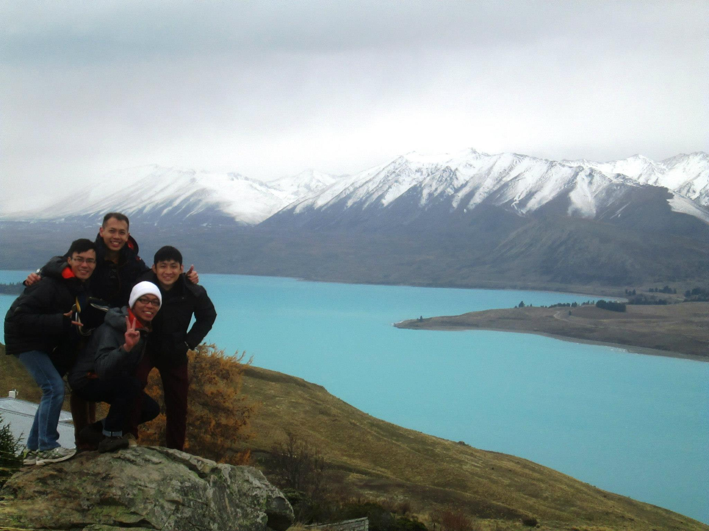

```{r echo = FALSE}

```

I’m turning 28 soon. And as another year of my life is coming to a close with the big 3-0 beginning to loom frightfully close, I, like many others, use this as a time of reflection. I’ve been looking back at all the wonderfully hard learnt life lessons, the varied experiences that helped propel me to where I am today. 

It’s funny when I come to think of it: the more I age, the more open I become to learning about myself, my loved ones and my surroundings. I believe this applies to you too. 27 is a magical age, where most of my peers are either tying the knot or have already settled down for their beautiful futures ahead. 

To be honest, 27 was incredibly difficult. Coming of age and entering the society for the first time as an adult made me feel really helpless. The never ending responsibilities, expectations, deadlines and office politics felt like a train wreck. Those days of early twenties and teenage years where we were all so sure that we’ve got life all figured out; where we want to be by 30, what we want to achieve, faded away like the final curtain call of our carefree days. 

But this is also the year I became the most disciplined (comparatively to my previous years). I finally have the clearest vision of what I want to do with my life. Faced with rejections after rejections from my job search in the past year, I have successfully landed a position in a prestigious organization. I have an amazing circle of friends and family, good health and while I may not feel particularly like I have achieved much; I know I’ve grown and built resilience. 

And that’s progress. 

My 27th year of existence gave me plenty of question marks, but it also left me with a lot of answers. Though I still have countless areas of myself that need improvement such as being more professional in my work and life, in my relationships and spiritual search; I want to share with you what have worked for me, and maybe it will be beneficial for you to. 

1. **Being an adult is simply all about how good you are at googling for the right answers.** Sometimes you just need to follow your gut because no one is an expert on living right. Just live the way you want to.

2. **Live with your mistakes because you can’t turn back the time.** So focus on how you can do better in the present for your future instead of brooding about the past.

3. **Don’t take your health for granted.** Our well-being is the greatest gift bestowed upon us. Without it, nothing else really, matters.

4. **Finding your passion is important.** With that said, I have to clarify that passion does not come to us with a snap of our fingers. It is cultivated through time and action. As long as you find something that aligns with your morals and interests, it is good enough.

5. **Live with gratitude.** It reminds you of the positive things in life and turns you into a happier person. 

6. **We are not alone.** Don’t fall into the trap thinking that no one understands your unique situation. With more than 6 billion people on Earth, it is statistically impossible for you to be presented with a set of challenges that no one else have experienced before (unless you happen to be left on Mars like Matt Damon in “The Martian.”). What this means is that no matter how tough you think the situation is, there will always be a solution. 

7. **Fake it till you make it? No, don't do that.** Mere pretence without hard work is akin to thinking that you can fly a plane just because you played an aircraft simulation game. Without effort and practice, people can easily see through your veil of made-up puffery.

8. **Make time for your friends.** They say that the people you meet earlier into your childhood, tend to be those who will be with you for the rest of your life. And I fully concur.

9. **Look for a job that you love.** Life is simply too short to waste it hating something that you spend most of your waking hours on. But don’t quit your job till you’ve another one lined up for you. 

10. **Stop comparing yourself to others.** We all come from different start points. Life is a journey, not a race. You don’t have to compete with those around you. 

11. **It is perfectly okay to be slower.** Sometimes we take more time to achieve something. Why rush when you can enjoy the journey? 

12. **Learn to befriend without expectations.** Sometimes, even the closest people may turn into acquaintances. And that’s okay, because our priorities shift too. 

13. **Burning the midnight oil does not equate to the most productive or most fun.** Sometimes a good night’s rest is more important than all these. 

14. **You don’t have to dress to impress (Unless it is an interview!).** Those who like you couldn’t care less what you show up in generally, and those who don’t won’t be taken to you just because you are suddenly clad in branded goods. 

15. **Someone lied.** You don’t have to get life all figured out after university. 

16. **Don’t be too sentimental over items.** After losing my best friend to a suicide at 21, I was devastated. As time passes, it made me realize that our memories weren't in our things. It was inside of me.

17. **You control your happiness.** Say a boss berated you for something you did not do. Instantly, your mood drops and you become unhappy for the rest of the day. But by cultivating a peaceful and positive mindset, and thinking from the perspective of your boss who could be stress over other issues, will have a dramatic effect on your mood. You will be able to lead a happier day, that one person’s source of unhappiness or one bad experience does not affect yours. 
18. **Make change a constant.** Stagnation be it in career, life and even mindset, is a terrible thing. Once you become too comfortable in your present state, you will start to slack off and view life passively. 

19. **Act the language of love.** This means that we must take action to show others that we care for them, and we love them. It is not passive, neither is merely saying “I love you,” enough. Life’s too short to be shy about such expressions.

20. **You are steering your own ship of life.** Take responsibility of your choices and decisions. Don’t count on others to make them for you. 

21. **Grudges are energy sapping.** Everyone make mistakes, and most people don’t even care what you think of them; neither should you. As you age, all these minor things and grievances matter lesser and lesser to you. Instead, focus on being better than who you were yesterday instead of trying to get back at someone who did you a bad turn. 

22. **Make learning your top priority.** Constantly seek to improve yourself. Don’t let your knowledge become obsolete. Like old electronics that get replaced with newer technologies every year, an outdated skill set can too be displaced by others. 

23. **Get rich quick doesn’t exist.** If someone tells you that, be very very wary. 

24. **Have a plan.** Just like a study schedule or a trip itinerary, your life too requires a plan. Draft out where you hope to be by a certain age. Want to save $50,000 by 25? Write it down and take action. Like the old adage, “if you fail to plan, you plan to fail.”

25. **You are not the centre of the universe.** You are not entitled to anything. No matter how wonderful your GPA in college was, success will not be handed to you. Nobody hands you anything unless you happen to be the child of Jack Ma or some influential businessman. If you crave success, don’t wait for it to approach you. Take action and hunt it down yourself. 

26. **Confront your fears.** Oftentimes, we are afraid of things for no reason at all. It may be how others perceive us, or worrying about things we don’t have a semblance of control over. The next time you find yourself in such a state, just ask yourself, “What am I scared of?”

27. **Simplify and love your life.** We all have the same amount of time in a day. It is time to clear out the junk we have been filling our day with. Like what Mother Theresa said in time immemorial, “The more you have, the more you are occupied. The less you have, the more free you are.”

Finally, though not as a point by itself, I am still trying to figure it all out. Despite having more than 6 billion people on this planet, no one has the exact unique life journey as you. You are the writer of your own life and my views here are not axiomatic to your own stories. They are not intended as some sort of maxims by which you should lead your life. 

**Whatever it is, love the body you’ve got. Live your life proudly.**


